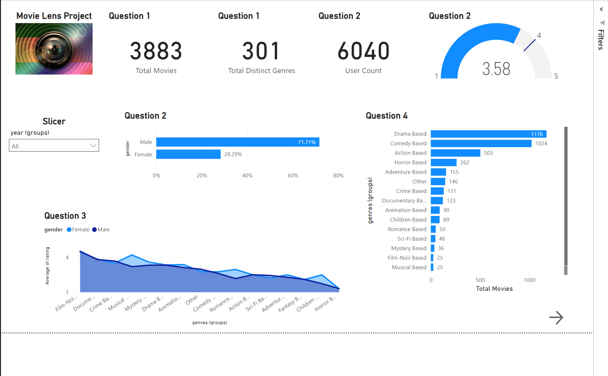
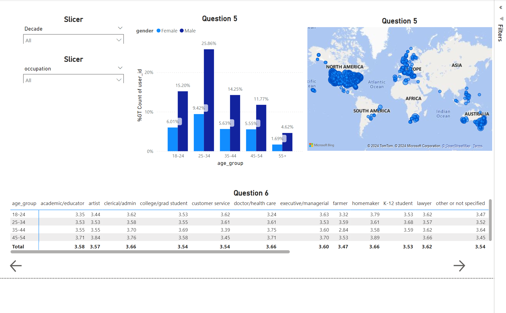
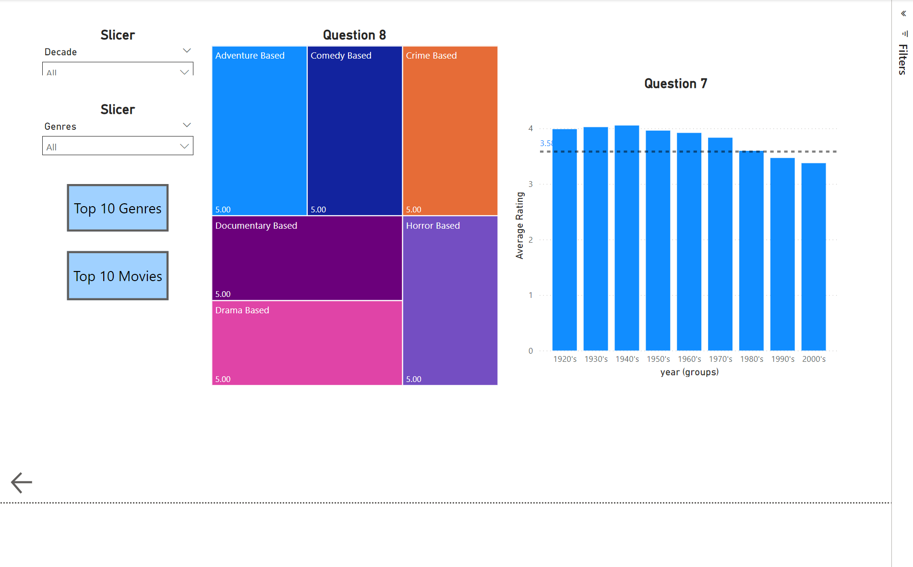

# MovieLens Classic Project

## Overview
This Power BI project explores the **MovieLens Classic Edition**, focusing on movies released until 2000. It provides insights into user demographics, movie ratings, genres, and trends.

## Key Features
1. Total Movies and Genres Analyzed.
2. Gender-wise and Age-wise Distribution of Ratings.
3. Top Movie Genres and Their Popularity.
4. Geographic Representation of Users.
5. Year-wise Average Ratings.

## Project Files
- `Project_movie_Lens.pbix`: Power BI project file.
- `images/`: Dashboard images.
  - `solution1_dashboard.png`
  - `solution2_dashboard.png`
  - `solution3_dashboard.png`
- `docs/`: Project report and methodology.

## How to Use
1. Download the `.pbix` file.
2. Open it in Power BI Desktop.
3. Explore the visualizations and insights.

## Dashboards
### Dashboard 1: Overview

### Dashboard 2: User Analysis

### Dashboard 3: Genre and Rating Trends

## Insights
1. **Demographics**:
   - Majority of users are male (~71%).
   - Most active users are aged between 25-34 years.
2. **Popular Genres**:
   - Drama and Comedy dominate in terms of the number of movies and ratings.
3. **Rating Trends**:
   - Older movies (pre-1980) generally receive higher ratings.

## License
This project is shared under the [MIT License](LICENSE).

---

